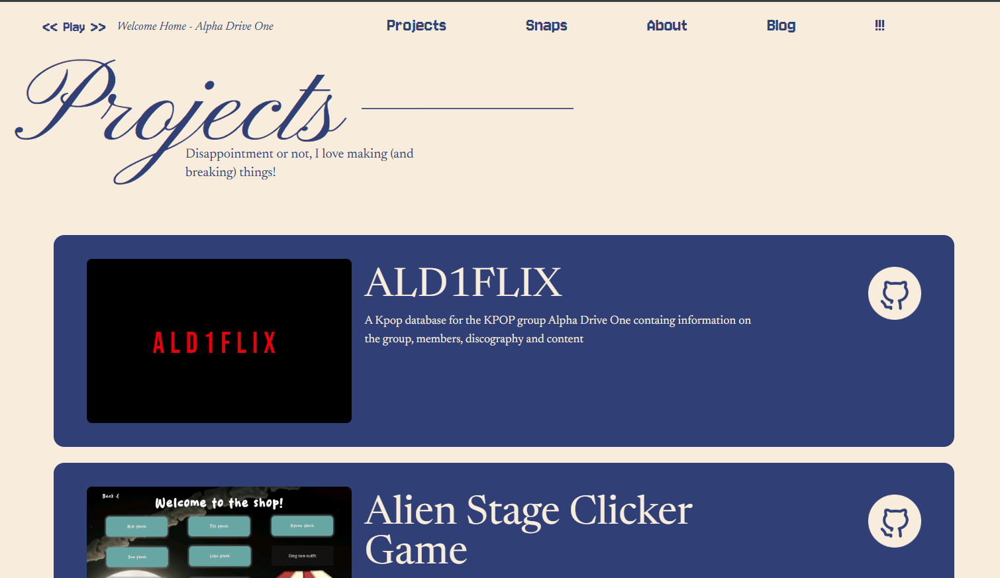

## Intro 
This is a remake of my previous personal website!! (koiiyomon.vercel.app) 

Update: THIS SITE IS MEDUIM RARE: Blog function is nonexistant but everything else is complete!!

My personal website was my very very first web dev project so it has alot of the aspects of a begginner project. Most notably the fact that I literally drew a mockup on a piece of paper
and then just balled with the design, hence why ESPECIALLY the main page is wacky. I've also been told that it doesn't really represent me which I think is fair enough lol. Now that i've gotten 
signifigantly better at webdev, I decided to remake my personal website to match my aesthetic and vibes (also for the fun of it so I don't get an eyesore everytime I open up my personal site)

I think my main motivation for this was a) to make stuff for horizons arcana and b) to have something to show when i'm applying for hack the north (mostly this reason). Hack the north is 
canada's biggest hackathon (i think) and for this year's application, there wasn't a lot of questions to show for the applicant's personality. Thats why I thiiiink making a personal website revamp (god I would never put my old one on the htn app) I can show off that part of me that I can't show with my application :( 

For this project I used my same ol same old favorite tools which are react router (I somehow chronically messed up the setup proccess this time), figma (lots of figma, im talking 5 hours of figma), tailwindcss and react. 

Re:ship update: 2 months later and the site is medium rare, ive added alot of features such as a mini music player, a message feature where users can send me messages (and also get toastered), a finished projects page, a somewhat working blog function (although its super incomplete), mobile optimization and I finally have hobbies!! 

## How this works
I decided to go with a Navbar setup this time so when you first load in the website you're greeted with a cool hero section

The navbar has 4 options, taking you between the blogs page, about page, home page (which is the !!!) and the projects page and a music player on the left side of the screen where you can listen to my favorite songs with a skip and a fast forward button

Scrolling down we have a small paragraph about myself

this is also followed by a bunch of buttons which lead to YOU GUESSED IT the same pages the navbar leads to (so blog button will lead to blogs ect etc...) but this time with a smalll description

When you click on the about page option you get redirected to a new page

Scolling down even more is a new feature, a message box! You can send messages to me and they'll go directly to my email/letterbox and I WILL read them. When you send a message, a toaster notification will pop up saying you sent a message, if you sent one without any contents, another toaster will pop up telling you to add content 

Also!! It looks different on mobile now!

Alot of the top section is just decor right now LOL but if you scroll down a bit you can see a 2x3 grid, now without blank boxes. If you're on PC - hovering over the boxes will show photos of my hobbies (except for photos because I got lazy lols).

Scrolling down more, you can find a fun facts section where you can read fun facts about me!!

The very last section on this about page is about my interests and the fandoms im in 

the section consists of 2 rows scrolling opposite directions, once you hover above the boxes, it will display the name of the fandom/interest

Going to the blog section

This is a pretty dang simple section, only consisting of a few sections for my blog post. It's pretty simple as of right now. no blogs have been made yet (i want to make a seperate system for that!)

Updated: This is still a pretty simple section HOWEVER, I did add mobile optimization, so if you view it on mobile view, the boxes will just stack vertically

Going to the projects section:

it's mostly just a bunch of vertically stacked divs that redirect you to my various projects, clicking the general div will redirect you to the live demo of the project, while the github icon will redirect you to the project's github repository

Right now there's not that many projects but trust me there will be in the future i'm just too lazy to add them lol
